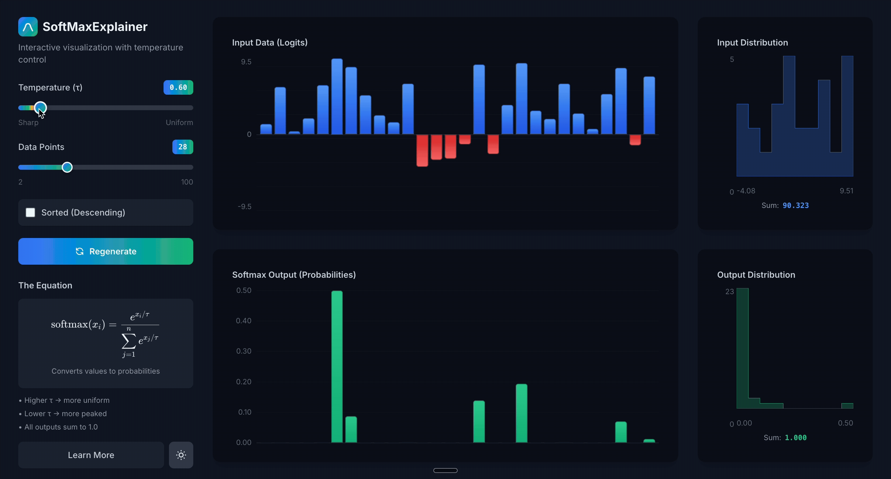

# SoftMaxExplainer


An interactive, educational visualization of the softmax function with temperature control. Built with SvelteKit and Tailwind CSS.

🔗 **[Live Demo](https://neovand.github.io/SoftMaxExplainer/)**

<p align="center" style="margin: 0; padding: 0;">
  
</p>

## ✨ Features

- **Interactive Visualizations** - Real-time bar charts and distribution histograms showing input logits and output probabilities
- **Temperature Control** - Adjust τ from 0.1 (sharp) to 5.0 (uniform) and see instant effects
- **Dynamic Data** - Generate random datasets with 2-100 data points
- **Sorting** - View data sorted in descending order
- **Dark Mode** - Seamless theme switching with beautiful color schemes
- **Educational Content** - Comprehensive guide with LaTeX equations, historical context (Boltzmann, Shannon, Jaynes), and mathematical derivations
- **Distribution Analysis** - Histogram views showing frequency distributions with area calculations

## 🚀 Quick Start

### Prerequisites

- Node.js 20+ 
- npm or pnpm

### Installation

```bash
# Clone the repository
git clone https://github.com/neovand/SoftMaxExplainer.git
cd SoftMaxExplainer

# Install dependencies
npm install

# Start development server
npm run dev

# Open http://localhost:5173 in your browser
```

### Build for Production

```bash
# Build the application
npm run build

# Preview the production build
npm run preview
```

## 🛠️ Development

### Project Structure

```
src/
├── lib/
│   ├── components/
│   │   ├── BarChart.svelte       # Main bar chart visualization
│   │   ├── Histogram.svelte      # Distribution histogram with area
│   │   ├── InfoModal.svelte      # Educational modal content
│   │   ├── LatexEquation.svelte  # KaTeX equation renderer
│   │   └── ThemeToggle.svelte    # Dark/light mode toggle
│   ├── stores/
│   │   └── theme.svelte.ts       # Theme state management
│   └── utils/
│       └── softmax.ts            # Softmax calculation & data generation
└── routes/
    ├── +layout.svelte            # Root layout
    ├── +layout.ts                # Prerendering config
    └── +page.svelte              # Main application page
```

### Key Technologies

- **SvelteKit 2** - Framework with Svelte 5 runes
- **Tailwind CSS 4** - Styling with custom gradients
- **TypeScript** - Type-safe development
- **KaTeX** - Mathematical equation rendering
- **Vite** - Fast build tool

### Available Scripts

```bash
npm run dev          # Start dev server
npm run build        # Build for production
npm run preview      # Preview production build
npm run check        # Type-check with svelte-check
npm run lint         # Lint code
npm run format       # Format with Prettier
```

## 📚 What You'll Learn

The application provides deep insights into:

- **Mathematical Foundation** - Formal definition, properties, and derivation from maximum entropy
- **Historical Context** - Journey from Boltzmann (1870s) to Shannon (1948) to Jaynes (1957)
- **Temperature as Lagrange Multiplier** - Step-by-step derivation showing temperature emerges naturally
- **Real-World Applications** - Computer vision, NLP, reinforcement learning, attention mechanisms
- **Limitations** - Understanding the softmax bottleneck and modern alternatives

## 🎓 Educational Value

Perfect for:
- Students learning machine learning fundamentals
- Educators teaching neural networks
- Researchers exploring probabilistic models
- Anyone curious about the mathematics behind AI

## 🤝 Contributing

Feel free to fork this project and extend it! Some ideas:
- Add more distribution visualizations
- Include numerical examples
- Add interactive comparison with sigmoid
- Visualize gradients and backpropagation

## 👨‍💻 Author

**Neo Mohsenvand** - Built for educational purposes

## 📄 License

Open source - free for educational use

---

*If you find this helpful, please star the repository!* ⭐
