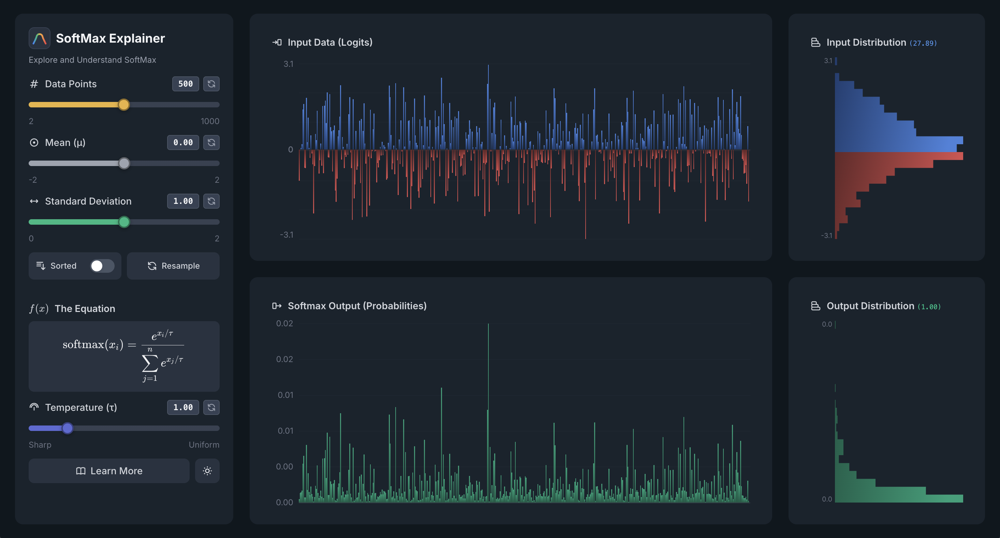

# SoftMax Explainer


An interactive, educational visualization of the softmax function with comprehensive controls for exploring probability distributions. Built with SvelteKit and Tailwind CSS.

🔗 **[Live Demo](https://neovand.github.io/SoftMaxExplainer/)**

<p align="center" style="margin: 0; padding: 0;">
  
</p>

## ✨ Features

### Interactive Visualizations
- **Real-time bar charts** showing input logits and softmax probabilities
- **Temperature (τ)**: 0.1 to 5.0 - Control sharpness from peaked to uniform
- **Horizontal distribution histograms** with adaptive binning (square root rule)
- **Supports 2-1000 data points** for exploring different scales
- **Auto-scaling axes** for maximum detail at any range

### Gaussian Data Controls
- **Mean (μ)**: -2 to 2 - Shift the distribution center (demonstrates translation invariance)
- **Standard Deviation (σ)**: 0 to 2 - Control spread (critically affects softmax output)
- **Data Points**: 2 to 1000 - Explore sample size effects on distributions

### Advanced Features
- **Sorted view** - See data in descending order
- **Color-coded sliders** - Visual feedback for each parameter
- **Dark mode** (default) - Beautiful theme with elegant color palette
- **Interactive experiments** - Embedded in Learn More with mathematical explanations

### Educational Content
- **Historical journey** - Boltzmann, Shannon, and Jaynes with photos
- **Mathematical derivation** - Temperature as Lagrange multiplier
- **Beautiful LaTeX equations** - Professional typesetting throughout

## 🚀 Quick Start

### Prerequisites

- Node.js 20+ 
- npm or pnpm
- make (optional, but recommended)

### Installation & Setup

**Using Makefile (Recommended):**

Clone the repository:
```bash
git clone https://github.com/neovand/SoftMaxExplainer.git
cd SoftMaxExplainer
```

Install and setup:
```bash
make setup
```

Start the development server:
```bash
make dev
```

**Alternatively, using npm:**

```bash
git clone https://github.com/neovand/SoftMaxExplainer.git
cd SoftMaxExplainer
npm install
npm run dev
```

Open http://localhost:5173 in your browser.

### Build for Production

With Makefile:
```bash
make build
```

Or with npm:
```bash
npm run build
```

## 🧪 Key Experiments to Try

1. **Translation Invariance**: Change Mean (μ) - softmax output stays unchanged!
2. **Scale Sensitivity**: Vary Standard Deviation (σ) - dramatic effect on output distribution
3. **Sample Size Effects**: Compare 15 vs 1000 data points - see the logistic normal distribution emerge
4. **Temperature Impact**: Low τ = confident, high τ = uncertain predictions

## 🛠️ Development

### Project Structure

```
src/
├── lib/
│   ├── components/
│   │   ├── BarChart.svelte       # Main bar chart with theme-aware gradients
│   │   ├── Histogram.svelte      # Horizontal histogram with split coloring
│   │   ├── InfoModal.svelte      # Comprehensive educational content
│   │   ├── LatexEquation.svelte  # KaTeX equation renderer
│   │   └── ThemeToggle.svelte    # Dark/light mode toggle
│   ├── stores/
│   │   └── theme.svelte.ts       # Theme state management
│   └── utils/
│       └── softmax.ts            # Softmax + Gaussian data generation
└── routes/
    ├── +layout.svelte            # Root layout
    ├── +layout.ts                # Prerendering config
    └── +page.svelte              # Main application page
```

### Key Technologies

- **SvelteKit 2** - Framework with Svelte 5 runes
- **Tailwind CSS 4** - Utility-first styling with dark mode
- **TypeScript** - Type-safe development
- **KaTeX** - Beautiful mathematical equation rendering
- **Box-Muller Transform** - Gaussian random number generation

### Common Development Tasks

**Makefile commands:**
```bash
make help           # Show all available commands
make check          # Type-check with svelte-check
make format         # Format code with Prettier
make lint           # Run linter
make clean          # Remove build artifacts
make rebuild        # Clean and rebuild
```

**NPM equivalents:**
```bash
npm run check       # Type-check
npm run format      # Format code
npm run lint        # Run linter
npm run test:e2e    # Run end-to-end tests
```

## 🤝 Contributing

Feel free to fork this project and extend it! Some ideas:
- Add more distribution types (uniform, exponential, etc.)
- Visualize gradients and backpropagation
- Add comparison with other activation functions
- Include more interactive experiments

## 👨‍💻 Author

**Neo Mohsenvand** - Built for educational purposes

## 📄 License

Open source - free for educational use

---

*If you find this helpful, please star the repository!* ⭐
